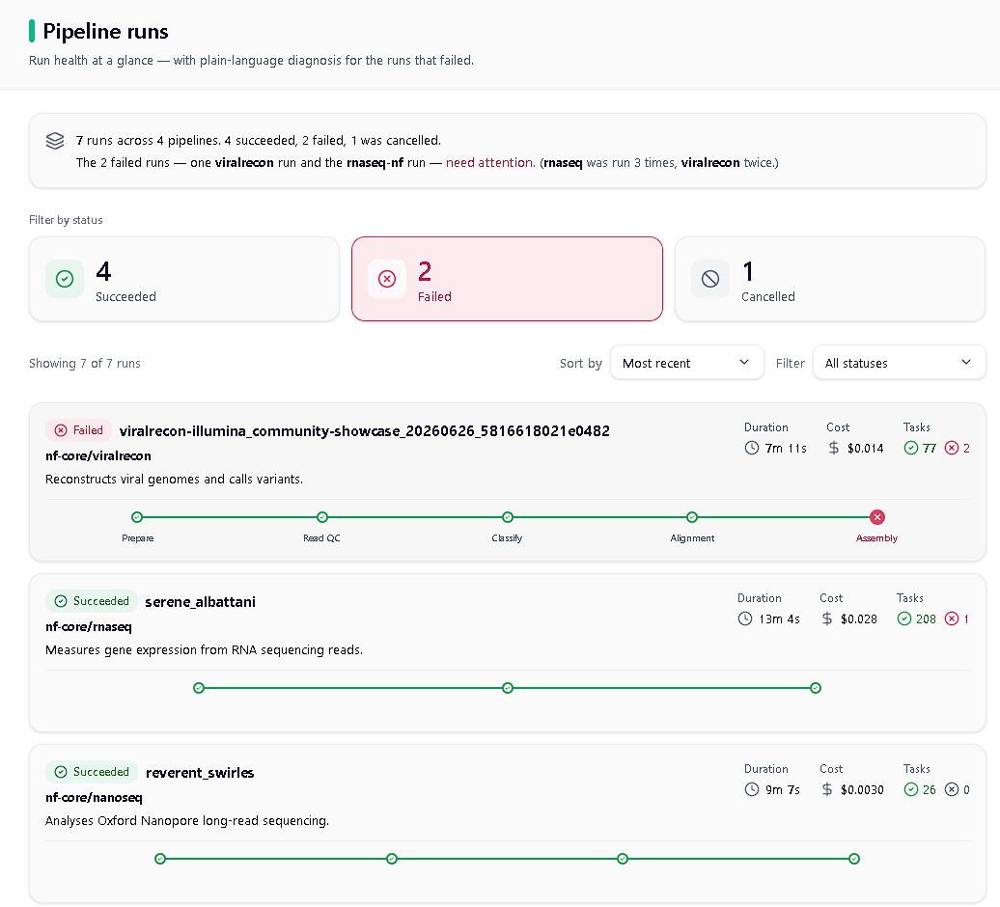
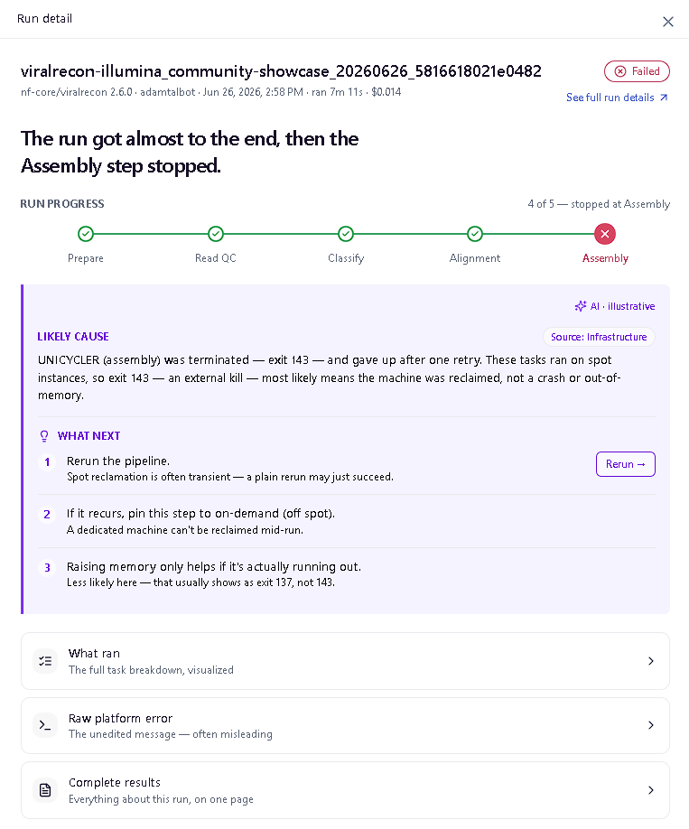

# Pipeline Run Status Dashboard

**Live demo → https://assignment-isadora.vercel.app/**

This is a run status dashboard, built as **one slice, done deeply**. Rather than touching every
part of the platform, I redesigned a single experience — **run monitoring** — properly: a Runs
Overview and a Run Summary, with the **failed run treated as the centerpiece**. The whole thing
is organized around one idea, **progressive disclosure**: you read the situation first, then
drill down only as far as you actually need, and the platform's existing full detail is always
one click away. Everything on screen is reconstructed from the real execution data — nothing is
invented.

> Runs Overview — run health at a glance, with each run's phase roadmap

<p align="center"></p>

> Run Summary — run progress, likely source, and the grounded cause…

<p align="center"></p>

## How to run it

```bash
npm install
npm run dev        # then open the printed URL (default http://localhost:5173)
npm run build      # runs the type-check and the production build
```

Requires Node 18 or newer (developed on Node 22).

## How it fits into the existing product

This is an addition to the current experience, not a rewrite of it:

- **Replace** — the Runs Overview takes the place of today's flat runs list, but adds a health
  summary, cost, task ratios, plain-language descriptions, filtering and sorting, and a phase
  roadmap for each run.
- **Insert** — the Run Summary is a new step *between* clicking a run and the platform's existing
  detail. It interprets what happened before you reach the raw data.
- **Preserve** — "See full run details" opens the platform's existing eight-tab view, completely
  unchanged. The deep detail experts rely on is still there, one click away.

## What the data taught me (and why the design looks the way it does)

The most important thing to understand about the dataset is that it's an **execution record, not
the scientific results**. It tells you how each run *behaved* — timing, cost, which steps ran and
whether they succeeded — but not what the pipeline actually produced. Those outputs live in cloud
storage and are only referenced by a path. Every design decision below follows from reading the
data closely:

- **The raw error message is unreliable.** On the main failed run, it's a truncated banner that
  names the *wrong* tool, and the run's own exit status reads `0` even though it failed. So instead
  of showing that message, the Run Summary **reconstructs** what happened from the task-level
  signals, which are trustworthy.
- **A run's status and its tasks' statuses are not the same thing.** A run can succeed overall
  while one of its tasks failed and then recovered on a retry. I surface that plainly ("one task
  failed and recovered") so it's neither hidden nor alarming.
- **There are two very different kinds of failure.** One died *mid-run* (a step was killed after
  many others had succeeded); the other died *on arrival* (about eight seconds in, before any task
  ran). They need different explanations, so a run that never really started shows an honest
  "nothing ran" rather than an empty chart.
- **The task list in the data is truncated,** so the reliable counts come from the summary fields
  (`stats` and `load`), and any partial list of task rows is labelled as a sample.
- **Exit code 143 means the task was killed from the outside** — most likely a reclaimed spot
  machine — not that it ran out of memory (that would be code 137). The data confirms these tasks
  ran on spot instances, so the diagnosis and the "Likely source" tag say *Infrastructure*, and
  the suggested fixes are ordered accordingly.

## Interaction choices, and the reasoning behind them

- **Progressive disclosure throughout.** Each view shows one idea at a time, you open a "door" to
  go deeper, and there's always a way back. The overview is for *triage* ("which runs need me?");
  the Run Summary is for *understanding one run*.
- **Lead with meaning, not status.** A failed run opens with a plain-language headline of what
  happened, not just a red "Failed" badge — you already know it failed; the useful thing is *why*.
- **The phase roadmap.** A small visualization shows the road each run travelled and where it
  stopped. It's the same component in two places — a compact version on each overview row, and a
  fuller "run progress" version in the summary — so the two can never disagree.
- **Failure is treated as a first-class diagnosis.** The summary answers four questions in order:
  *where* it broke (the roadmap), *whose fault* it likely was (a hedged "Likely source" tag),
  *why* (a grounded explanation), and *what to do next* (concrete suggestions you choose from).
- **AI is used honestly, with two levels of trust made visible.** The interpretive parts (the
  likely source, cause, and suggestions) sit together in one violet region clearly marked
  "illustrative" — a hand-built stand-in for what a live model would produce. The factual parts
  (the summary line, the counts, the progress) are computed directly from the data and carry no AI
  label, because they're always correct.

## Component and code choices, and the reasoning behind them

- **A clear split between logic and rendering.** All the code that *decides what to show* — reading
  the data, deriving the roadmap, building the diagnosis, computing the summary — lives in a data
  layer (`lib/`) with no UI in it. The React components only *render* what that layer produced. I
  kept them separate because the interpretation logic is the interesting part, the most likely to
  change, and the most likely to move to a server later, so it's easier to reason about and test on
  its own.
- **One roadmap component, used in both screens,** so the overview and the summary can never drift
  apart.
- **Visualizations are hand-drawn in SVG** (the donut, the gauges, the roadmap) rather than pulled
  from a charting library — so they match the product's look, stay lightweight, and each shows
  exactly one thing.
- **The three UI states are real.** Loading (a skeleton while data loads), empty (when a filter
  matches nothing), and failed (the diagnosis) are all actual code paths, not mock-ups. Types are
  derived from the real data shape, and there's no use of `any`.

## Tradeoffs I made

- **Depth of interpretation over exhaustive raw detail.** The Run Summary explains; the platform's
  existing detail view holds the exhaustive data (full provenance, per-process metrics, raw logs).
  I link out to it rather than rebuilding it — the summary's job is to *interpret*, not to duplicate.
- **A focused slice over broad coverage.** One experience built well, rather than many built
  shallowly — which is the scoping the brief asks for.
- **Hand-built visuals over a charting library** — more work up front, but a native feel and a
  lighter result.
- **Honesty over demo polish.** I didn't fake a real-time view or recreate the results report,
  because this dataset is entirely after-the-fact and contains no live data or scientific outputs.
  A flashier demo would have been dishonest about what the data supports.

## What I'd build next

The Run Summary interprets, so its natural next steps *deepen the interpretation* rather than add
raw-data panels:

- **With the same data:** a richer diagnosis and fuller source classification; aggregate charts on
  the overview (cost and duration across runs); grouping runs by pipeline; a real AI model behind
  the summary; a toggle between a concise and a fuller view; and turning the "Rerun" button into a
  real action.
- **With more data:** **real-time runs** — the roadmap is already built to fill in live as a run
  progresses; it just needs live telemetry, which this dataset doesn't have.
- **Deliberately left to the existing detail view** (I preserve and link to it, rather than
  rebuilding it): provenance, per-process resource charts, and raw logs.

## Accessibility

I treated accessibility as a design constraint from the start and audited it against the running
app — with an automated scanner (axe), a full keyboard pass, and a colour-contrast check — rather
than just reviewing the code. The whole app is keyboard-operable; when you open a run, focus moves
into the panel, and when you close it, focus returns to the row you opened. Status is always shown
with an icon and text as well as colour (never colour alone), the phase roadmap carries a spoken
description for screen readers, and motion is disabled for anyone who prefers reduced motion.

## Documents in this repo

- **DESIGN-DIRECTIONS.md** — the design principles the whole thing follows.
- **ai-interaction-principles.md** — how the AI behaves and why.
- **NOTES.md** — a running decision log, plus the field-by-field check that every number in the UI
  traces back to the real data.